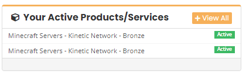
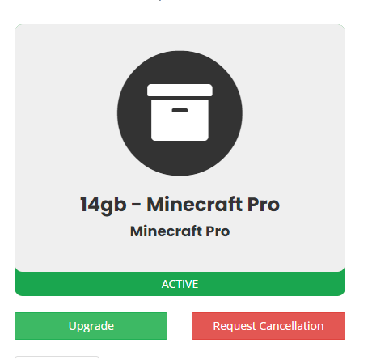

# How To Cancel a Server

To cancel a server, head to the client portal here: https://client.kinetichosting.net/

Once you’ve logged in with your account information, you should see our billing dashboard. Here you’ll see a box that lists all your current active products

To cancel your server, just press on the service you would like the cancel. This should take you to a page with more information about the packages. Here is where you can cancel the server.

Just press on the run button labelled request cancellation

When cancelling a server, you’ll have two options. You can choose to cancel it immediately, or at the end of your billing period.

If a server is cancelled immediately, the server will be closed immediately. This will lock you out of any files you have on your server. We do keep your files for 7 days after the cancellation but keep this in mind when choosing the immediate cancellation.

If you choose to cancel at the end of the billing period. The server will be closed when your next bill is due to be taken. You can use your server as normal up until this point.