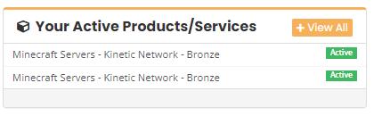
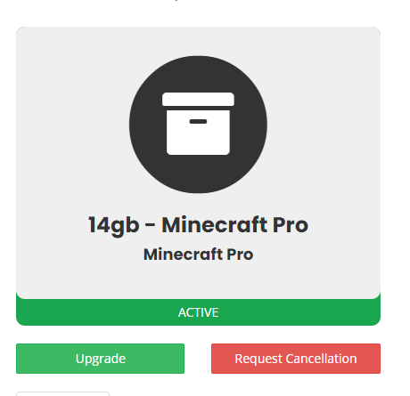

# How to Upgrade/Downgrade a Server

To upgrade/downgrade a server, head to the client portal here: https://client.kinetichosting.net/

Once you’ve logged in with your account information, you should see our billing dashboard. Here you’ll see a box that lists all your current active products

To upgrade/downgrade your server, just press on the service you would like the upgrade/downgrade. This should take you to a page with more information about the packages. Here is where you can cancel the server.

Just press on the run button labelled request upgrade

Then just choose the package you would like your server to be changed to.
NOTE: Moving from a Budget to a Performance server will mean your IP changes, and might take a little longer