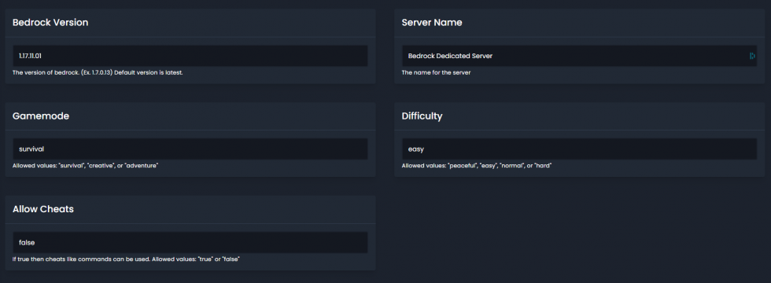

# Updating Minecraft Bedrock Server
Updating your bedrock server is simple. First head to the settings page on the panel.

Here you’ll see the version box. To update the server simply put the new version number in this box, and restart the server.
The server will download all the files and update for you.