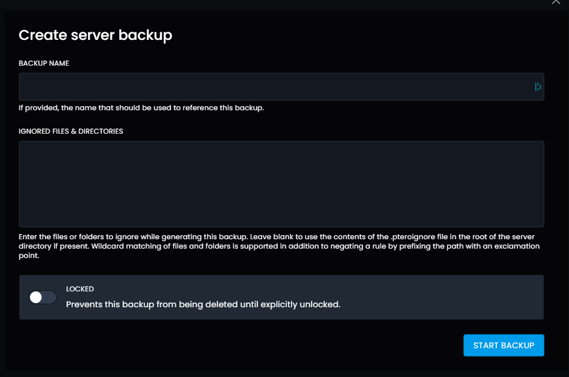
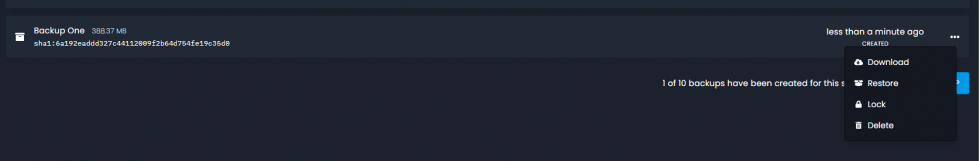

# Making Backups
To make a backup of your server, head to the backups page under tools

To make your backup, press the create backup button

You should see a page like this

The first box is the name of your backup, the second is files you want to be ignored.

So if you would like to backup everything apart from your world file. You can just put world here, and it will be ignored in the backup.

The lock stops the backup from being deleted until it’s unlocked. This is helpful if you have a backup running on a schedule.

## Restore a Backup

Once the backup has been made you can restore it, or download it by pressing the three dots

Pressing the restore button will fully restore the backup to your server overriding any newer files.