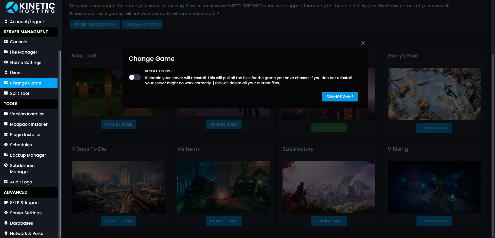

# Changing Game

import Callout from 'nextra-theme-docs/callout'

<Callout type="warning" emoji="⚠️">
  Most games will require a Dedicated IP as they require multiple ports to be open on your system.
</Callout>
The feature is in Beta, we are working to simply the process.

Using the Game Swap Tool you can change the game your server is running anytime. Note that most games will need a Dedicated IP, these come with Performance+ packages, or you can order one here https://client.kinetichosting.net/cart.php?gid=addons

## Selecting Your Game
To change game, head to the Change Game section of the panel. Here you can see a list of all the games we offer. Please note that games marked with LIMITED SUPPORT, means our panel supports the game, but our support staff might not be able to help you if you run into issues. Use these games at your own risk. 

Once you've selected the game you want, you'll be greeted with this information box

Here you have opt to reinstall your server, or just change the game type. Reinstalling your server will removed all your current files. So if there is anything you want to keep, be sure to make a backup.

<Callout type="warning" emoji="⚠️">
  If you don't reinstall your server, then you might have boot issues. A full reinstall is strongly recommended.
</Callout>

## Setting The Correct Port
Now your server is installed, we need to set the correct port. To do this, we're going to head to the Network & Ports option under Advanced. 

Here you need to change the primary port.
Select the port for the game you're running for the list below.

If you don't have these ports in your Network & Ports section, then you may need to order a Dedicated IP.

### Game Port List

Minecraft - 25565

Minecraft: Bedrock - 19132

Satisfactory - 7777

Valheim - 2456

Rust - 28015

Ark - 7777

Garry's Mod - 27015

7 Days To Die - 26900

Project Zomboid - 8766

Terraria - 7777

Unturned - 27015

V Rising - 9876

