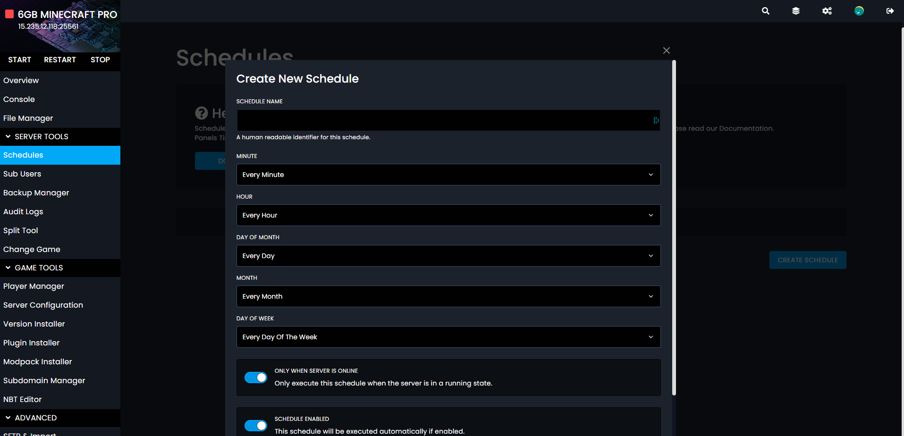

# Schedules

Schedules are a powerful tool that allows for you to automatically run actions on your server. This could be a backup, restart, or a command.

## Setting The Time
First we need to set the time these schedules will run. This can look a little complex at first, but don't worry, we'll guide you over it all. For basic times, you can pop out the cheat sheet.

### Box Values
The first box in the minute box, so here you can put a value from 0 to 59. Each of these being an minute past the hour. 
The next box is the hour box, here you can put a value from 0 to 24.
After that, the day of the month box, here you can put a value from 1 - 31. This will select the day in the month the task will run.
Then we have the month box, this can have a value from 1 - 12.
Finally we have the day of the week box. This can be a value from 0 - 6. With 0 being Sunday, then counting forward from there. So Monday, will be 1, Tuesday 2, etc.

### Setting For Every
An * can be used for every, and a / can be used for every of a set time. Let's put that into an example.

If we put */5 * * * *
So that's */5 in the first box, then * in all the others.

This will run the task every 5 minutes everyday, every month, every hour.

If we remove the */ and just put a 5. This will run the task at every 5th minute of the hour. So 1:05, 2:05, 3:05, etc

Let's put that into another example. If you wanted a task to run every day at 1am, your would put

0 1 * * * 

However, if you wanted to run it every hour, you would put

0 */1 * * *

### Still Not Sure?
If you're still not sure how this system works, you can head to this website: https://crontab.guru/
It shows what everything means in simple terms. 

## Setting Actions
Now you've set the time, we now need to set the actions. Once you've made the schedule, press on it, and you'll be taken to the task page.

Pressing on the new task button will allow for you to set a task for your schedule. 

Once the box is open you can select the type of schedules. 
Commands are game commands, so for Minecraft if you wanted to say something in the server, you could put the say command. Making sure not to use a /.

Power actions are restart, start, stop, and kill.

Backups allow for you to make backups using the backup manager.

