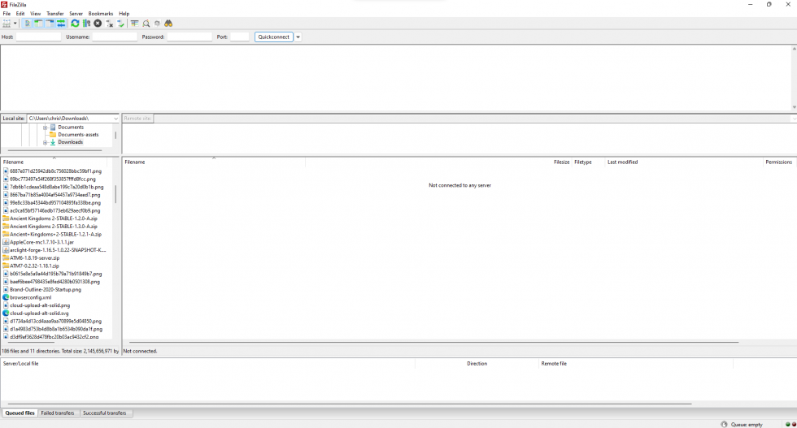
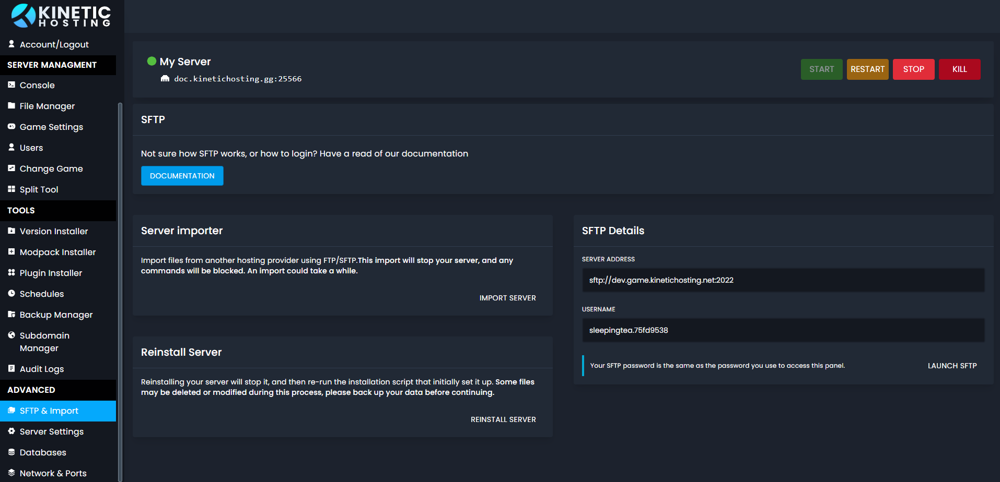

# Using SFTP (FTP)

First, we’ll cover what SFTP is and why you might want to use it. If you know all this, and just want to know how it works, then you can skip over this section.

Our panel has an inbuilt file manager. This is what you’ll use 90% of the time. However, there might be some actions you need an FTP client for. Such as uploading unzipped or big files.

## SFTP, FTP, FTPS?

If you’ve been with a host before, you likely know FTP. Our panel uses SFTP. This works mostly the same but encrypts your authentication and data files.

## Let’s Get Started

If reading isn’t your thing, we have a handy video covering this on our YouTube channel.
https://www.youtube.com/watch?v=UfC2Jlao7Mk

First, we need to download an FTP client. We recommend using FIleZilla, however, another FTP client will work fine.

You can download FileZilla Here: https://filezilla-project.org/ You need to download the client version, not the server version.

Once that’s installed open the program, you should see a window like this

Now we have FileZilla, we now need to connect to the server. For this, we need to head to the panel. Under the advanced section, you’ll see SFTP Info. Should look like this:

We now need to copy this information into FileZilla. On the FileZilla client, you should see the following boxes.
Host, Username, Password, and port. Followed by the quick connect button.

For this example, we need to copy: sftp://ns5008987.ip-15-235-12.net into the host box
tutorial.1ab27839 into the username box
and 2022 into the port box.

The password will be the same password you use to login to the panel.

Once you’ve entered the information, press the quick connect button. That’s it, you’re all setup and connected.