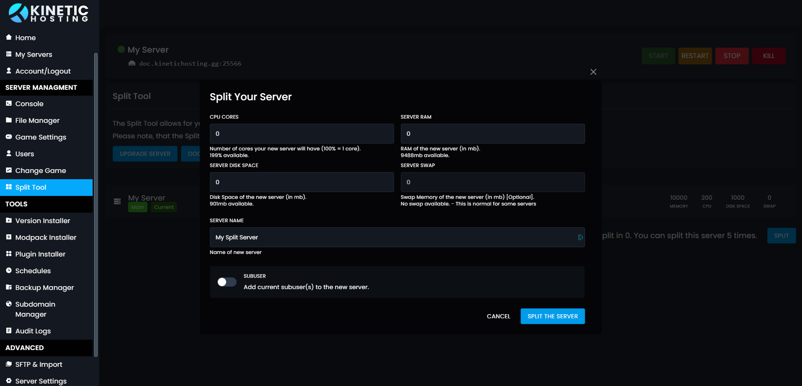

# Split Tool
The Split Tool allows for you to split your server to create multiple servers on one plan. You can then use these servers to make a network, host another game, or just as an extra server to host a new world, version or modpack.

Let's put this into an example. If you own 10gb Server, you can split this into two 5gb Servers. 
Budget Servers only have with two split slots, but Performance and Performance + packages can be split 4 times.

If you need more split slots, you can order them here: https://client.kinetichosting.net/cart.php?gid=addons

## How To Split A Server
To split a server head to the Server Split Tool under Server Management. Here you can split the server.
You can also manage your splits here, and remove any splits you no longer want. Removed splits will give their resources back to the main server.

## Setting Resources
Once you've hit the split button, you'll see this menu. Here you can give resources to your new server. When applying the resources make sure to keep in-mind that the server you're splitting. 

The fist box is for your CPU Cores. 100% is one core. We recommended not giving less then 1 Core to your split server

The next box on the right, is how much ram your split server will give. This is in megabytes, so make sure to give it the correct amount. For example if you want to give 1gb, it needs to be 1000, not 1. 

Under both those on the left, is how much space your split server should have. Again this is in megabytes.

Next to that on the right, this is your servers SWAP. (If you're not sure what SWAP is, you can find out more on our What Is SWAP Page). Again this is in megabytes.

Finally, you can set the server name, and if you want the sub users to carry over.
