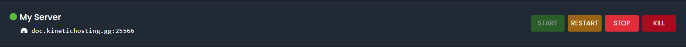

# Starting Your Server
So now you’ve logged into our panel, we now need to start the server.

In most cases, your server should be started for you after you ordered it, but just in case, this is how you can start the server.

First head to the My Servers section, then press on the console.

Here you’ll see this bar

The green button starts the server, the grey one restarts it, the red one stops the server, and finally, the red one with the skull icon kills the server.