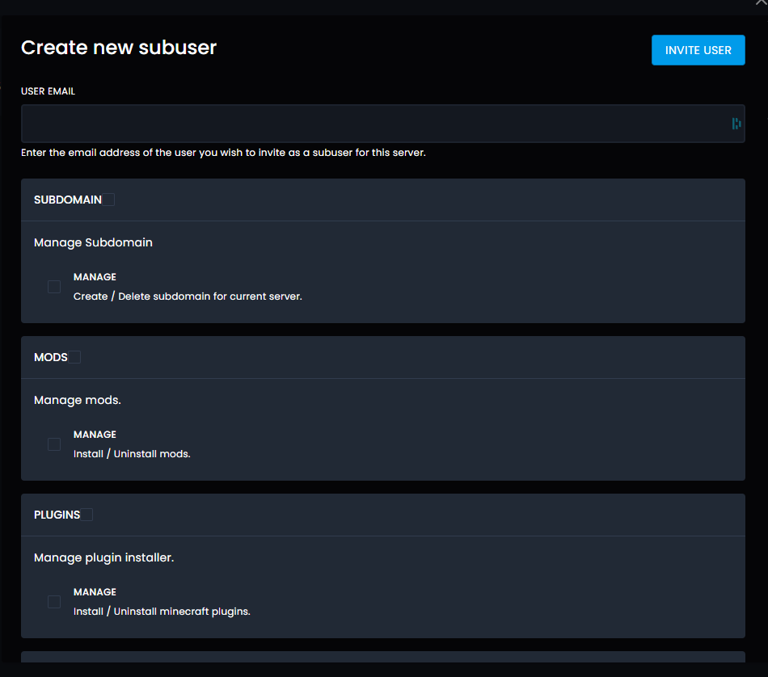

# Add Another User To Your Server

If you would like someone else to be able to manage your server, you can add them under the user’s section.

Just head to manage, then users. Once there, press New User. You should then see a box like this:

First, enter the email address of the person you would like to add. Then select the permissions you would like them to have on your server. So if you would like them to only be able to restart the server (for example), under control just tick restart.

Once you’ve done setting all the permissions, press the invite button

If the person you’re adding already has an account with us, they will now see the server on their server list. If they don’t, they will now have an email with information on how to set up their account.