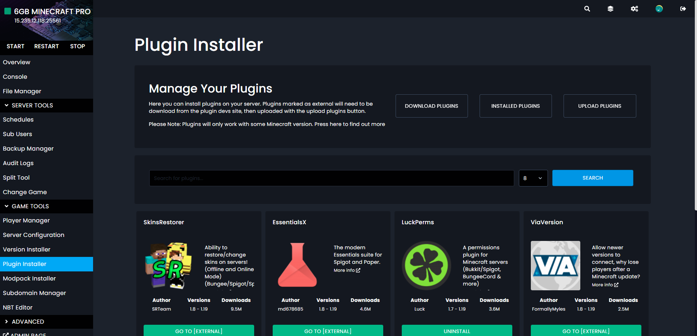

# Kinetic Panel 3.0 is Here.

Here is a quick run down of some of the new features and changes in the new Kinetic Panel 3.0.

## A New UI

The new Kinetic Panel has had a full UI overhaul to no only make the UI easier to read, understand and navigate. But to also allow you to use the panel on any device no matter the screen size. A huge focus of 3.0 was to make sure it look and work well on mobile phones.

The new UI also includes our new overview screen. The overview screen allows you to quickly see all parts of your server, hop to the most used settings, and change key setting based on the game your server is running.

## Easier Schedules

3.0 now has a new create schedule section. Allow you to set the time of your schedules with easy to understand drop downs, rather then the cron syntax we used before.

## Audit More

Our audit logs have had an upgrade. Before not everything was logged. You didn't know what commands your users ran, if a modpack was installed, or anything that happened when using SFTP. With the 3.0, the audit logs now track more.

## Player Manager (Minecraft)

For Minecraft Java users, our panel now sports a player manager. Here you can see all the players online on your server, turn on and add people to the whitelist, op and drop players, and ban users.

All of this making it simple and easy to see who is banned, whitelisted.

## Server Configuration (Minecraft)

Our games setting page has now been replaced. For all games apart from Minecraft Java the settings can now be found on the overview page. For Minecraft Java we've added the Server Configuration page. The Minecraft Server Configuration page allows for you to edit even more setting than before. We've also updated it, so it will no longer override setting set directly in the config files.

## Version Installer (Minecraft)

Not a new feature, but its had a big update. Our version installer now supports more versions, and updates a lot faster than before. The version installer has a had a number of quality of life updates, such as automatically restating the server after a new version has been installed.

## Plugin Installer (Minecraft)

The plugin installer is way more advanced than it was before. Allowing you to manage installed plugins and upload your own plugins along side installing them from Spigot.

## And More

These are just some of the things that's we've added or improved on, but if we listed them all, this page would be huge. The main goal of 3.0 is to make it even more simple to use your server, while still keeping all the advanced offerings there. Along side a lot of quality of like changes, like our new UI, Overview page, and simple toggle for things like the Aikar flags.

## This Isn't The End

Update 3.0 has laid to ground work for more upcoming changes and feature. Big improvements for other games that are not Minecraft, along side more feature to make Minecraft servers easier to manage.

Like always we welcome all feedback on Panel 3.0.
